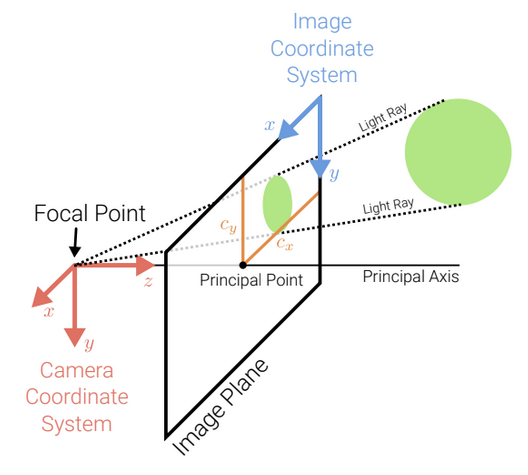
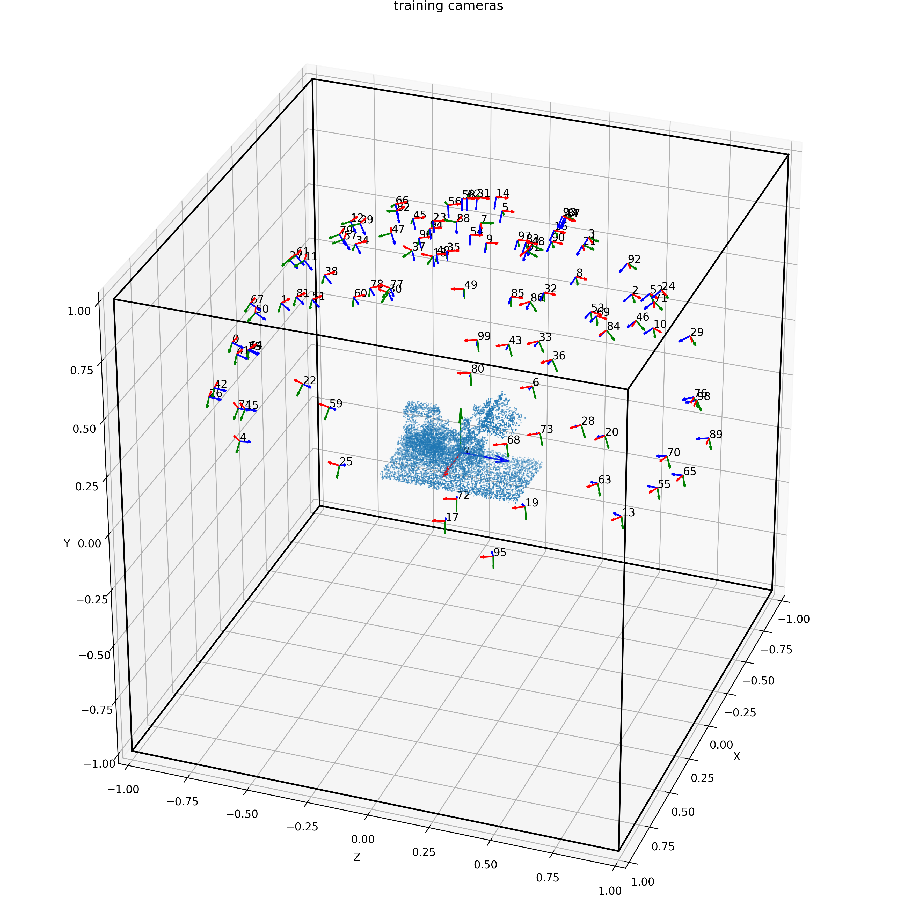
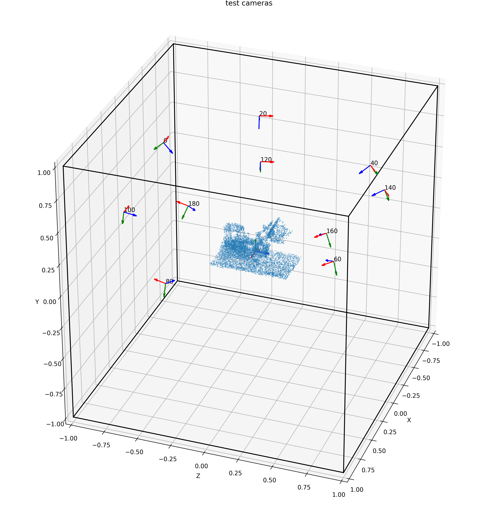

# MVDatasets


### Standardized DataLoaders for 3D Computer Vision

[Stefano Esposito](https://s-esposito.github.io/), [Andreas Geiger](https://www.cvlibs.net/)
<br>
University of Tübingen, Autonomous Vision Group (AVG)

```
⚠️ This is a work in progress research codebase designed with a focus on modularity; future updates *will try* not to disrupt existing functionalities.
```

---

Our goal is to provide a plug and play library to quickly develop and test new research ideas. We offer various data loaders for commonly used multi-view datasets in 3D reconstruction and view-synthesis, that work out of the box without further data processing.


<table>
<tr>
<td>

**Static:**
- [x] [NeRF-Synthetic](#): bounded
- [x] [Shelly](#): bounded
- [x] [DTU](#): unbounded
- [x] [Mip-NeRF360](#): unbounded
- [ ] [NeRF-LLFF](#): forward-facing

</td>
<td>

**Dynamic:**
- [ ] [PanopticSports](#): multi-view, bounded
- [ ] [D-NeRF](#): semi-monocular, bounded
- [ ] [iPhone](#): monocular, unbounded
- [ ] [DynamicScenes](#): monocular, unbounded
- [ ] ...

</td>
</tr>
</table>

## Cameras

We use the OpenCV camera coordinate system:
- X-Axis: Points to the right of the camera's sensor. It extends horizontally from the left side to the right side of the image. Increasing values move towards the right side of the image.
- Y-Axis: Points downward from the camera's sensor. It extends vertically from the top to the bottom of the image. Increasing values move towards the bottom of the image.
- Z-Axis: Represents depth and points away from the camera lens. It extends from the camera's lens outward into the scene. Increasing values move away from the camera.

<p float="left">
  
  
</p>   

Images taken from Andreas Geiger's Computer Vision [lectures](https://uni-tuebingen.de/fakultaeten/mathematisch-naturwissenschaftliche-fakultaet/fachbereiche/informatik/lehrstuehle/autonomous-vision/lectures/computer-vision/) at the University of Tübingen.


## Installation

```bash
# 1) install requirements
conda create -n mv_datasets python=3.8
conda install -c "nvidia/label/cuda-11.8.0" cuda-toolkit
conda install pytorch==2.1.0 torchvision==0.16.0 torchaudio==2.1.0 pytorch-cuda=11.8 -c pytorch -c nvidia
pip install -r requirements.txt
pip install -e .
```

Configure your datasets root folder path in `config`, e.g.:
```python
Config.datasets_path = Path("/home/stefano/Data")
```

## Testing

```bash
# reproduce images
python tests/train_test_splits.py --dataset-name dtu
python tests/camera_rays.py --dataset-name dtu
python tests/reproject_points.py --dataset-name dtu
python tests/tensor_reel.py --dataset-name dtu
python tests/pixels_sampling.py --dataset-name dtu
python tests/overlay_bounding_primitives.py --dataset-name dtu
```

e.g.: `python tests/train_test_splits.py --dataset-name blender` should render:

<p float="left">
  
  
</p>

## Disclaimer

Functions located in any `.deprecated` folder may no longer work as expected. While they might be supported again in the future, this is not guaranteed.

## Citation

If you use this library for your research, please consider citing:

```bibtex
@misc{Esposito2024MVDatasets,
  author       = {Stefano Esposito and Andreas Geiger},
  title        = {MVDatasets: Standardized DataLoaders for 3D Computer Vision},
  year         = {2024},
  url          = {https://github.com/s-esposito/mvdatasets},
  note         = {GitHub repository}
}
```