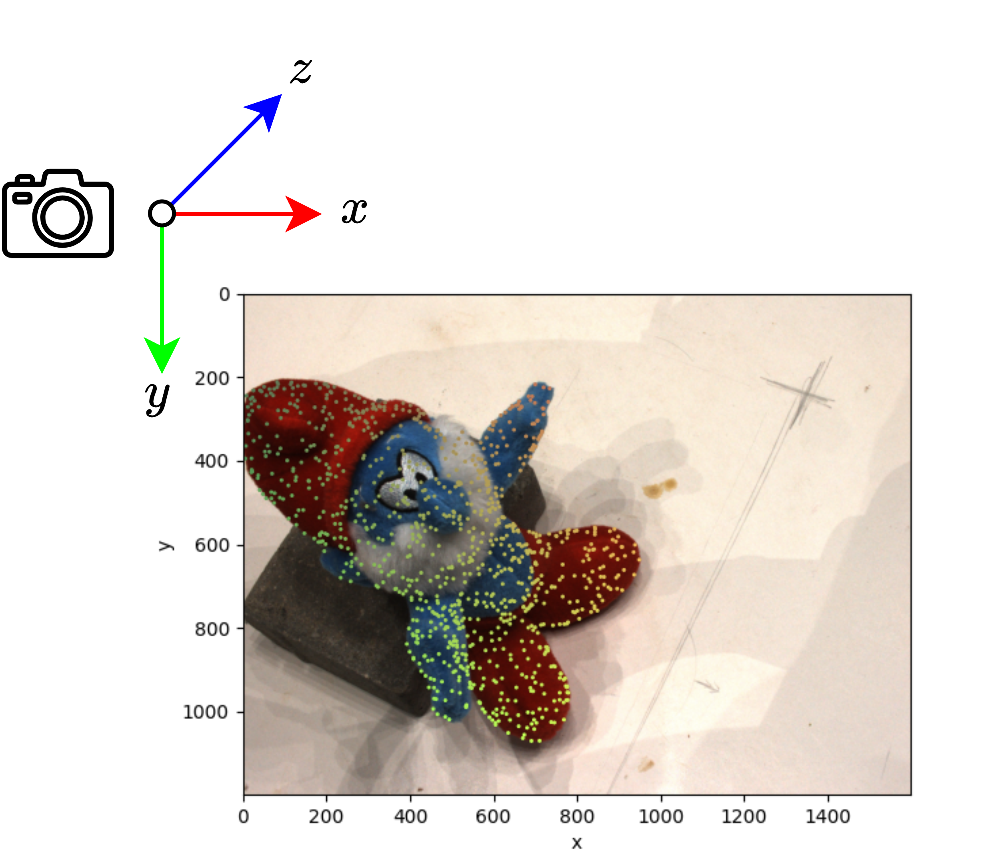
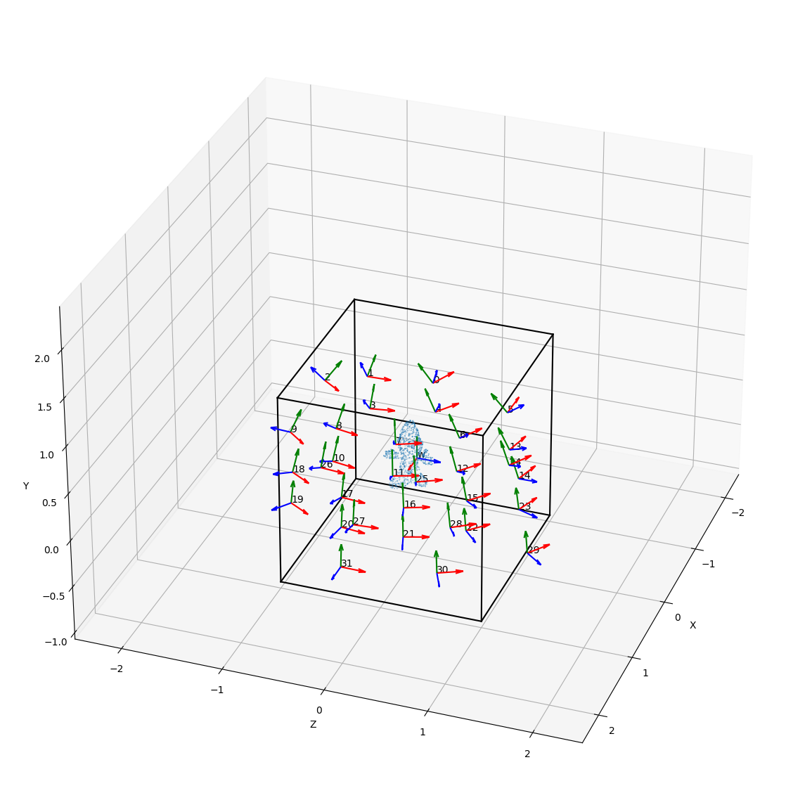
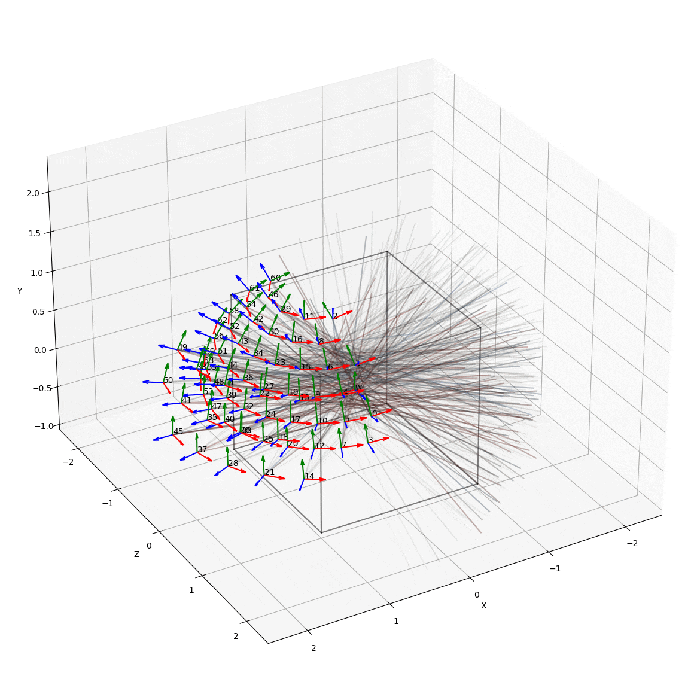

# DataSets: standardized loaders for multi-view datasets

[Stefano Esposito](https://s-esposito.github.io/),
<br>
University of Tübingen, Autonomous Vision Group

Various data loaders for multi-view datasets commonly used in 3D reconstruction and view-synthesis.

Static (3D):
- [DTU](#)
- [NeRF-Synthetic](#)

Dynamic (4D):
- [PAC-NERF](#)

Soon to be supported:
- [NeRF-LLFF](#)
- [NeRF-360](#)

## Cameras
This code uses an "OpenGL" style camera coordinate system:
- *Right Vector* ($`x`$): Represents rightward direction.
- *Up Vector* ($`y`$): Represents upward direction.
- *Forward Vector* ($`z`$): Represents backward direction (along negative Z-axis).
    
<p align="middle">
  
</p>

<p align="middle">
  
</p>

<p align="middle">
  
</p>

<!---

# Citation

If you use this library for your research, please consider citing:

```
@inproceedings{datasets,
	title        = {DataSets: Standardized Loaders for Multi-View Datasets},
	author       = {
		Stefano Esposito
	},
	year         = 2023
}
```

# Contributors

<a href="https://github.com/s-esposito/datasets/graphs/contributors">
  
</a>

-->