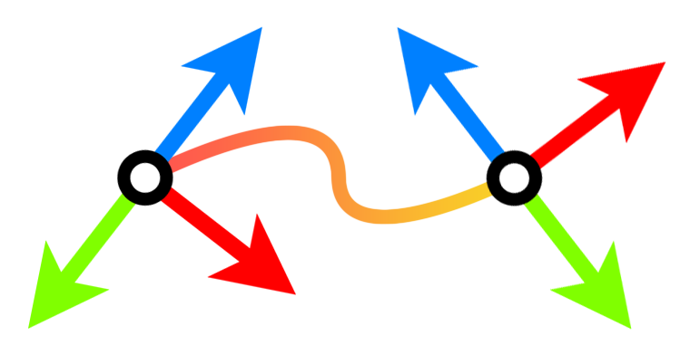

# MVDatasets




### Standardized DataLoaders for 3D Computer Vision

[Stefano Esposito](https://s-esposito.github.io/), [Andreas Geiger](https://www.cvlibs.net/)
<br>
University of Tübingen, [Autonomous Vision Group](https://uni-tuebingen.de/fakultaeten/mathematisch-naturwissenschaftliche-fakultaet/fachbereiche/informatik/lehrstuehle/autonomous-vision/home/)

[](https://github.com/autonomousvision/mvdatasets/actions/workflows/unit-tests-main.yml) [](https://github.com/autonomousvision/mvdatasets/actions/workflows/unit-tests-dev.yml) [](https://github.com/autonomousvision/mvdatasets/actions/workflows/deploy-docs.yml)

```
⚠️ This is a work in progress research codebase designed with a focus on modularity; future updates *will try* not to disrupt existing functionalities.
```


Our goal is to provide a plug and play library to quickly develop and test new research ideas. We offer various data loaders for commonly used multi-view datasets in 3D reconstruction and view-synthesis, that work out of the box without further data processing.

## Documentation

Don't miss out on our [documentation](https://autonomousvision.github.io/mvdatasets/index.html). It's still a work in progress, but together with our [examples](examples), it is the best way to get started. 

### Installation

Install the module from source using `pip install .`. More details [here](https://autonomousvision.github.io/mvdatasets/source/installation.html).

### Datasets

Checkout the state of currently supported datasets or work in progress [here](https://autonomousvision.github.io/mvdatasets/source/datasets.html).

### Camera

Our standardized camera uses the OpenCV camera coordinate system and it is described [here](https://autonomousvision.github.io/mvdatasets/source/datasets.html).

<p float="left">
  
  
</p>

Images taken from Andreas Geiger's Computer Vision [lectures](https://uni-tuebingen.de/fakultaeten/mathematisch-naturwissenschaftliche-fakultaet/fachbereiche/informatik/lehrstuehle/autonomous-vision/lectures/computer-vision/) at the University of Tübingen.

## Examples

```bash
# download data in ./data
bash scripts/download/nerf_synthetic.sh
# visualize dataset splits
python examples/dataset_splits_vis.py --scene-name lego data:nerf-synthetic
```

<p float="left">
  
  
</p>

## Disclaimer

Functions located in any `.deprecated` folder may no longer work as expected. While they might be supported again in the future, this is not guaranteed.

## License

This project is licensed under the Creative Commons Attribution 4.0 International License (CC BY 4.0). See the [LICENSE](LICENSE) file for details.

You are free to use, modify, and distribute this code as long as you provide proper attribution to the original author(s).

## Citation

If you use this library for your research, please consider citing:

```bibtex
@misc{Esposito2025MVD,
  author       = {Esposito, Stefano and Geiger, Andreas},
  title        = {MVDatasets: Standardized DataLoaders for 3D Computer Vision},
  year         = {2025},
  url          = {https://github.com/autonomousvision/mvdatasets},
  note         = {GitHub repository}
}
```